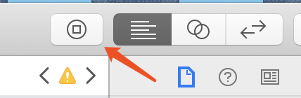

# 2019-02-16 ARTS

> what？什么是ARTS
* Algorithm：每周至少做一个leetcode的算法题;
* Review：阅读并点评至少一篇英文技术文章；
* Tip/Techni：学习至少一个技术技巧；
* Share：分享一篇有观点和思考的技术文章；


## Algorithm

```swift
/**
 * Question Link: https://leetcode.com/problems/two-sum/
 * Primary idea: Traverse the array and store target - nums[i] in a dict
 *
 * Time Complexity: O(n), Space Complexity: O(n)
 */
 
 class Solution {
    func twoSum(_ nums: [Int], _ target: Int) -> [Int] {
        var dict = [Int: Int]()
        
        for (i, num) in nums.enumerated() {
            if let lastIndex = dict[target - num] {
                return [lastIndex, i]
            }
            
            dict[num] = i
        }
        
        fatalError("No valid outputs")
    }
}
```

题目大意：给出 N 个数，在其中找出和为一个特定数的两个数。

声明一个字典，key 是数组里某个数，value 是这个数在数组里的 index
循环遍历数组，通过 dict[target - num] 判断字典里面是否存在**相加和的另一个数**，如果存在则获取了那个数在数组的 index，直接return

如果字典内不存在，把当前遍历到的数作为 key 放入字典，value 是数在数组中的 index

## Review

[IGListKit Tutorial: Better UICollectionViews](https://www.raywenderlich.com/9106-iglistkit-tutorial-better-uicollectionviews)

**IGListKit** 是Instagram推出的新的 **UICollectionView** 框架，使用数据驱动，旨在创造一个更快更灵活的列表控件。

`Raywenderlich` 之前就出过这个库的教程，现在他们对代码进行了升级改进，如果读者有复杂多变的列表需求，根据教程来实践下吧。

## Tip/Techni

### Xcode 10 新特性：

#### access object library quickly

打开 storyboard 文件时，右上角多了个图标，点击它可以快速查找控件并创建

快捷键：**command + shift + L**



#### multicursor editing

添加多个光标同时编辑

快捷键：control + shift + 鼠标(或者上下方向键)
然后快捷键：shift + option + 上下方向键 

#### column-wise changes

多行选择编辑

快捷键：按住 option，鼠标变成十字，然后移动鼠标进行选中编辑

## Share

[iOS系统中导航栏的转场解决方案与最佳实践](https://segmentfault.com/a/1190000016815365)

iOS 导航栏一直是个麻烦的解决点，随着业务的增长，经常会有无导航栏，滚动隐藏和显示导航栏，前个界面无导航栏后一个有导航栏的各种状况。

美团技术团队提供了他们的解决方案与实践，对我们当前项目有很大的借鉴意义，在此分享下。
