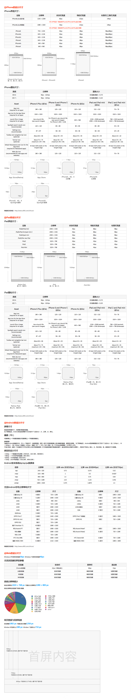

## 2015-09-08

最近很多初学iOS的朋友都问我appIcon要多大的，启动图片是什么尺寸，为什么一定要这个尺寸，常常弄得我头都大了，
特别是某些公司的美工还很任性的说为什么要这么大，这么多的图片。我在这只想说不为什么，要求就这样。

###iPhone（iOS7及以上）
- appIcon 需要图片大小：58×58，80×80，87×87，120×120，180×180
- 启动页 需要图片大小：320×480(非必须)，640×960，640×1136，750×1334，1242×2208

##我在这放上一张iOS APP设计规范图，美工们你们照着做就行了，拜托了

