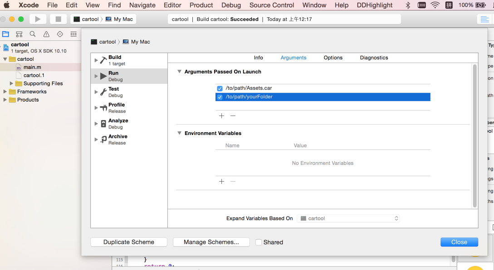

#Assets.car文件的解析
Xcode6之后，苹果为了规范iOS图片，推出了**Assets.xcassets**文件夹专门管理@2x，@3x的图片，使得整个工程变得更加整洁，更方便查找图片。把工程打包成ipa后会变成**Assets.car**文件，苹果对图片进行压缩，增加了开发者获取别的APP资源图片的难度。

##解决办法
开发者这个极具智慧的群体怎么会没有解决方案呢，github上有很多开源工具可以获取**Assets.car**中的图片，我在这里介绍开源工具

[cartool](https://github.com/steventroughtonsmith/cartool)

github上**cartool**的原始项目是不支持获取@3x图片的，另外一个开发者在它的基础上修改增加了@3x图片的获取

**[cartool](https://github.com/G-P-S/cartool)**
==使用这个fork可获取@3x图片==

使用方法：
```
1. 到github上下载cartool项目
2. 设置 数据源路径 和 目标路径
3. 在Xcode中编译运行
```
**数据源路径：Assets.car路径**
**目标路径：获取的图片文件输出路径**




